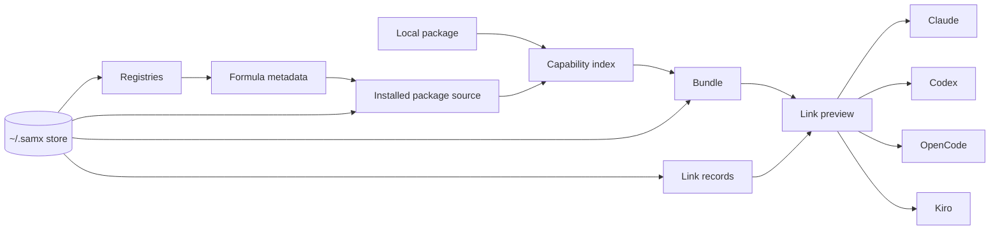

# SAMX

[](https://www.npmjs.com/package/@c3qo/samx)
[](LICENSE)
[](packages/cli/package.json)
[](pnpm-workspace.yaml)

SAMX is a local-first package and bundle manager for AI development capabilities. It lets you discover skills, agents, and MCP servers, install them once, group them into project bundles, and link those bundles into tools like Claude, Codex, OpenCode, and Kiro.

Use SAMX when your AI development setup has outgrown copy-pasted prompt files, one-off MCP configs, and per-tool manual wiring.

## What SAMX Does

- Installs capabilities from registries, Git-backed formulas, local packages, and generated MCP formulas.
- Indexes skills, agents, MCP servers, package requirements, advisories, and hooks.
- Builds named bundles from installed capabilities.
- Links bundles into supported tool layouts with previews and recorded outputs.
- Analyzes existing AI config files for inventory, risks, and readiness.
- Stores package checkouts, registries, bundles, and link records locally under `~/.samx` by default.

## Quickstart

Install the beta CLI:

```sh
npm install -g @c3qo/samx@beta
# or
pnpm add -g @c3qo/samx@beta
```

Sync the default registry and search for something useful:

```sh
samx registry sync
samx search shell
```

Add a capability to the current project:

```sh
samx add owner/repo:skills-review --tool claude
```

Remove it from the current project bundle:

```sh
samx remove skills-review --tool claude
```

Inspect what SAMX knows about the project:

```sh
samx analyze .
samx formula show owner/repo
samx capability list
```

Use the interactive terminal UI for package, capability, bundle, and link workflows:

```sh
samx tui
```

Use the lower-level commands when you want explicit package, bundle, and link control:

```sh
samx pkg install owner/repo
samx bundle create coding
samx bundle add coding owner/repo:skills-review
samx link coding --tool claude --project .
samx unlink coding --tool claude --project .
```

For the full CLI command surface, see [`packages/cli/README.md`](packages/cli/README.md).

## Environment Variables

SAMX reads these environment variables:

| Variable | Use |
| --- | --- |
| `SAMX_HOME` | Override the local SAMX store. Defaults to `~/.samx`. |
| `SAMX_NO_UPDATE_CHECK=1` | Disable update notifications. Same effect as `--no-update-check`. |
| `CI=true` | Disable update notifications in CI/non-interactive runs. |
| `OPENAI_API_KEY` | Required for `samx formula generate`, `samx formula discover-mcp`, and `samx formula generate-mcp-list`. |
| `OPENAI_MODEL` | Default model for formula generation and MCP discovery when `--model` is omitted. Defaults to `gpt-4.1-mini`. |
| `INIT_CWD` | Advanced: initial cwd used by package-manager invocations before falling back to `PWD` and `process.cwd()`. |
| `PWD` | Advanced: cwd fallback when `INIT_CWD` is unset. |

Examples:

```sh
SAMX_HOME="$PWD/.samx-dev" samx registry sync
SAMX_NO_UPDATE_CHECK=1 samx capability list
OPENAI_API_KEY="sk-..." samx formula generate https://github.com/owner/repo
OPENAI_API_KEY="sk-..." OPENAI_MODEL="gpt-4.1-mini" samx formula discover-mcp https://example.com/servers
```

Package capabilities may require their own environment variables, such as `GITHUB_TOKEN`. SAMX reports those requirements during analyze, bundle check, link preview, and TUI flows; they are package-specific, not global SAMX settings.

## Simple Architecture



The main flow is:

1. Registries describe available formulas.
2. Formula packages or local packages provide source files.
3. SAMX indexes package capabilities: skills, agents, and MCP servers.
4. Users add capabilities to bundles.
5. Link previews show what SAMX will write or symlink into a target tool.
6. Link records let SAMX update or unlink only the outputs it manages.

## Concepts

- **Registry:** searchable catalog of formulas.
- **Formula:** package metadata that points to source and declares capabilities.
- **Package:** installed formula source or tracked local source.
- **Capability:** a skill, agent, or MCP server exposed by a package.
- **Bundle:** named set of capabilities selected for a project or workflow.
- **Link target:** supported tool layout such as Claude, Codex, OpenCode, or Kiro.
- **Link record:** SAMX-managed record of files, symlinks, MCP entries, and hooks written during link.

## Monorepo Layout

SAMX is a pnpm TypeScript monorepo:

```text
packages/
  schemas/  Zod schemas and shared domain types
  core/     registry, package, capability, bundle, link, analyze, report logic
  cli/      cac command wiring, Ink TUI, bundled published CLI
```

Primary entrypoints:

- `packages/core/src/index.ts` exposes the CLI-facing core API.
- `packages/cli/src/index.ts` wires commands and exports injectable `runCli()` for tests.
- `packages/cli/dist/index.js` is the bundled published CLI output.

## Development

Install dependencies:

```sh
pnpm install
```

Run the main verification loop:

```sh
pnpm typecheck
pnpm test
pnpm build
pnpm lint
pnpm format:check
```

Run a focused test:

```sh
pnpm vitest run packages/core/test/scanner.test.ts
```

Build before CLI smoke tests:

```sh
pnpm build
pnpm --filter @c3qo/samx exec samx analyze packages/cli/test/fixtures/messy-project
```

## Package Sources

Formula and local packages can expose capabilities using these layouts:

```text
skills/<name>/SKILL.md
agents/<name>/AGENT.md
agents/<name>/agent.md
mcp/<name>/mcp.json
```

MCP package files may also use target-specific formats such as Claude `.mcp.json`, OpenCode `opencode.json`, or Codex TOML. SAMX normalizes those into capability records and renders target-specific output during link.

## Security Model

SAMX is local-first: registries, package checkouts, local package records, bundles, and link records live under `~/.samx` unless `SAMX_HOME` points elsewhere.

Git registry and formula operations use restricted protocol settings:

```text
protocol.ext.allow=never
protocol.file.allow=user
```

Formula source URLs must use allowed transports such as `https:`, `git:`, `ssh:`, or trusted/local `file:` sources. Link operations preview generated outputs before apply, record what SAMX manages, and unlink only recorded outputs.

Package advisories and hook candidates are surfaced before link. Advisory-bearing packages require explicit allowance before SAMX applies links.

## Status

SAMX is currently published as a beta CLI package. Install `@c3qo/samx@beta` for the current release line. Stable `@c3qo/samx` installs are intended after the first stable release.

## License

MIT
